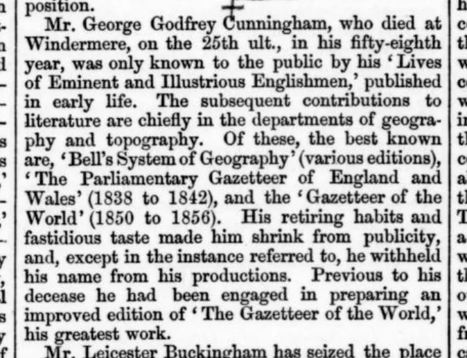

# Gazetteer of the World → Linked Data

Turning a 19th-century printed gazetteer into a structured, AAT-typed, geolocated
**authority gazetteer** for the [World Historical Gazetteer](https://whgazetteer.org/) (WHG).

> **Scope note.** This began as a portable, locally-runnable recipe, but the working pipeline now
> depends on **Pitt CRC infrastructure** — a GPU cluster (Slurm + vLLM) for self-hosted OCR and LLMs,
> and WHG's own Elasticsearch gateway at Pitt for reconciliation. It is therefore **not turn-key
> reproducible** by an outside DH researcher, and is best read as a **thoroughly-documented record** of
> how this specific gazetteer is being digitised and ingested into WHG — and as a design reference for
> anyone with comparable infrastructure. The *shape* of the pipeline (OCR → parse → typed LLM extraction
> → reconciliation) generalises; the *implementation* assumes the cluster.

Source: **Royal Geographical Society**, *A Gazetteer of the World, or Dictionary of Geographical
Knowledge* (Edinburgh: A. Fullarton & Co., 1856), 7 vols. The work was published anonymously —
"edited by a Member of the Royal Geographical Society" — so the **RGS is cited as the corporate
author**; the anonymous editor is identified as
**[George Godfrey Cunningham](https://en.wikipedia.org/wiki/George_Godfrey_Cunningham)**.
[archive.org/details/agazetteerworld00unkngoog](https://archive.org/details/agazetteerworld00unkngoog).



> **We OCR the public-domain scans ourselves.** Rather than reuse a third-party transcript, we run
> the **1856 first-edition page images (HathiTrust vols 1–7)** through a modern layout-aware OCR model
> ([Surya](https://github.com/datalab-to/surya)) on a GPU cluster — fully public-domain, no licence
> encumbrance, and cleaner than the 2015 OCR it replaces (see [the OCR stage](#1-ocr-the-scans--processocr_pagespy)).
> Volume VII's **Appendix** is a prize in its own right: a bidirectional ancient↔modern toponym
> concordance — see [the Appendix concordance](#6-volume-vii-appendix--toponym-authority).

---

## Pipeline overview

The stages of *historical PDF → geolocated linked data*, and how this project does each:

| Stage | What it does | Approach / what we found |
|------|-------------|---------------------|
| **0. OCR the scans** | Self-OCR the public-domain page images with a **layout-aware** model. | No inherited OCR (licence + quality). Surya reads diacritics/coordinates cleanly; it won't split dense columns, so we reconstruct two-column reading order from line geometry. Runs as a GPU Slurm array. |
| **1. Parse to records** | Split the flow into one row per source record, keeping **provenance** (page). | Parse defensively: entries are delimited only by the ALL-CAPS-headword print convention — cross-references and continuations masquerade as entries; validate against spot-checks. |
| **2. Model the target** | Decide the unit of interest and a controlled vocabulary for typing it. | Mine the *actual* descriptors for their categories; resolve to real Getty AAT ids and **validate every id** so a typo fails loudly. |
| **3. Self-hosted LLM extraction** | Run every record through **self-hosted open models** for schema-constrained structured output. | Free (no per-token cost): a **primary extractor** (Llama-3.3-70B) + a **critic** (gpt-oss-120B) + a **repair** pass (Qwen3-thinking) on the flagged minority; closed AAT enum enforced; sharded across GPUs. Chosen by a 7-model A/B ([`docs/model-comparison.md`](docs/model-comparison.md)). |
| **4. Reconcile / geolocate** | Match each place to WHG via a **containment-aware cascade** (resolve admin parents to WHG polygons, then match **inside the parent region**, `contained_in`, before country). A **non-point tie-break** prefers a polygon-bearing match among near-ties. Where an entry prints its own **coordinates** they are authoritative: match the best name **within a radius** of the printed point, else keep it *located-but-unmatched*. | Precision-first then recall; containment disambiguates same-named places (recorded as partOf relations). **~95.6k of 116k matched + ~4.3k located-but-unmatched**; on-map boundary polygons quadrupled (≈13.6k). |
| **5. Publish** | Export linked data; explore it. | A static, server-less **single-page** GitHub Pages explorer: PMTiles map (points + WHG boundary polygons) + density heatmap, whole-corpus reader, in-browser search (FTS5 + trigram fuzzy + Symphonym phonetic via ONNX), a match-certainty filter, shareable `#entry=` links, in-context error reporting — all "fetch only what you need", no backend. |

**Infrastructure dependency.** Stages 0 and 3 require the **Pitt CRC GPU cluster** (Slurm + vLLM,
conda envs `whg`/`vllm`, fast `/vast/ishi` storage); stage 4 queries the WHG reconciliation service.
The lighter steps (parse, AAT build, toponym dictionary) are plain Python (`pymupdf`, `tiktoken`,
`pydantic`, `requests`, `beautifulsoup4`/`lxml`) and run anywhere. See [Setup](#setup).

---

## This project's pipeline

```
PD scans ─Surya OCR─▶ volume.txt ─parse─▶ entry ─extract─▶ place ─reconcile─▶ WHG id + coords ─▶ MapLibre explorer
(vols 1-7) (GPU array) (## p.N)             │     Llama-3.3-70B     │      containment cascade + non-point tie-break;
                                                                   │      printed coords authoritative (else coord-only)
                                   toponym-check   (self-hosted vLLM) │      (WHG gateway via public API)
                                   (toponyms.json) + gpt-oss critic
                                                   + Qwen-thinking repair (flagged ~7-11%)
                                                   AAT type · country · population · ethnonyms · multi-place

v7 Appendix ─Qwen2.5-VL─▶ name_variant ─▶ dict/toponyms.json        tables ─Qwen2.5-VL─▶ table_data
```

All LLM stages are **self-hosted on CRC GPUs** (vLLM) — no per-token cost. Reconciliation uses WHG's
public reconciliation service (which proxies to the same Pitt Elasticsearch gateway).

| Asset | Notes |
|-------|-------|
| `data/pdf/gotw-v{1..7}.pdf` | Per-volume public-domain scans, built from HathiTrust 600dpi images by `build_pdf.py`. The OCR input. Git-ignored; rebuild from source. |
| `data/txt/ocr/v{N}/p*.txt`, `data/txt/gotw-v{N}-ocr.txt` | Our **Surya OCR** output — one resumable file per page, merged per volume (`## p. N` markers). Produced by `ocr_pages.py`. Git-ignored. |
| `data/gotw_seg.sqlite` | Working store from the table-aware re-OCR (entry, place, table_data, back_matter, name_variant, qa, vlm_qa, llm_cache…). Git-ignored; rebuild from source. (Supersedes the earlier `data/gotw.sqlite`.) |
| `data/review.sqlite` | Signature-keyed human-review decision sidecar (survives re-parses/DB rebuilds). |
| `data/aat_shortlist.json` | 47 validated Getty AAT feature-type concepts (committed). |
| `dict/toponyms.json` | 27,528-toponym authority built from the Vol VII Appendix (committed). |

Source work: the **Royal Geographical Society** (1856), public domain — see [Credits](#credits).

### Setup

The light steps (parse, AAT build, toponym dictionary, reconciliation client) are plain Python and
run anywhere; the heavy steps need the **Pitt CRC cluster**.

```bash
# Light steps — run anywhere:
pip install pymupdf tiktoken pydantic requests beautifulsoup4 lxml

# GPU steps — Pitt CRC, via Slurm + vLLM (conda envs on /vast/ishi):
#   env `whg`  : surya-ocr + pymupdf            -> OCR        (process/submit_ocr_slurm.py)
#   env `vllm` : vllm 0.10.2 + torch 2.8+cu128  -> Llama / gpt-oss / Qwen / Qwen2.5-VL
#                (module load cuda/12.8.0 for FlashInfer JIT; VLLM_ATTENTION_BACKEND=FLASH_ATTN)
#   self-hosted model weights + the working DB live on /vast/ishi; servers bind localhost (no tunnel)

# Secrets in .env (git-ignored): WHG_API_TOKEN  (on CRC: ~/.gotw_env, chmod 600).
#   ANTHROPIC_API_KEY / GEMINI_API_KEY are optional — only for the API providers in the model A/B.
# The toponym cross-check reads a word list from dict/words or /usr/share/dict/words.
```

> **Reproducibility.** Stages 0 (OCR) and 3 (extraction) assume CRC's Slurm/vLLM environment and are
> not runnable as-is elsewhere; the `submit_*_slurm.py` scripts document exactly how they run there.
> Reconciliation (stage 4) needs only internet + a WHG API token.

### 1. OCR the scans — `process/ocr_pages.py`
```bash
# one page to stdout (quick check — needs a CUDA GPU)
python3 process/ocr_pages.py --pdf data/pdf/gotw-v5.pdf --start 84 --end 84
# shard a volume into resumable per-page files, then stitch into one volume .txt
python3 process/ocr_pages.py --pdf data/pdf/gotw-v5.pdf --out-dir data/txt/ocr/v5 --start 0 --end 199
python3 process/ocr_pages.py --pdf data/pdf/gotw-v5.pdf --out-dir data/txt/ocr/v5 --merge --out data/txt/gotw-v5-ocr.txt
```

We OCR the public-domain scans ourselves with **[Surya](https://github.com/datalab-to/surya)**, a
modern layout-aware OCR model. It reads this 1856 print far better than the 2015 transcript or
Tesseract: validated on a CRC L40S GPU it returns clean diacritics (*São-Pedro*, *Maranhão*), intact
coordinate glyphs (*S lat. 37° 10′*), and correct two-column reading order, at **~4 s/page** (0.4 s
layout + 3.5 s detect+recognise).

What generalises:
- **Layout segmentation has limits.** Surya's `LayoutPredictor` reliably finds **ruled tables and
  figures** — we route those to [`extract_tables.py`](#5-tables-maps-and-the-demo)/`extract_maps.py`
  and exclude them from the prose — but it treats the dense two-column body as a *single* text block; it
  will **not** split the columns. So we reconstruct **two-column reading order from the recognised
  line-box geometry** (left column top-to-bottom, then right). The page marker (`## p. N`) is read from
  the running-head number in the top margin.
- **Unruled statistical tables — detected content-agnostically, routed out of the prose.** The 1856
  stat tables have **no ruling lines**, so the layout model misses them and plain OCR linearises their
  cells into scrambled numbers that pollute the surrounding entry (a problem we hit in the long country
  essays — *France*, *Egypt*, *Sardinia*). We deliberately **don't** key off digit density (non-statistical
  tables — concordances, equivalence lists — exist) nor the page column-rule (tables also sit *inside* a
  column). What works is a **geometry gutter detector**: `ocr_pages.py` finds persistent vertical
  whitespace between narrow, populated columns on the OCR line-boxes (per-column **and** full-width) and
  routes those regions **out** of the reading-order text with a `<!-- table bbox=… -->` marker. A
  complementary **VLM page-triage** (`triage_pages.py`, Qwen2.5-VL) classifies every page and counts its
  embedded tables; the two detectors fail on *disjoint* pages, so table candidates are their **union**
  and the high-res table pass self-filters false positives. The prose stream stays clean; the boxed
  regions are digitised separately by the [table pass](#5-tables-maps-and-the-demo). (Full detector
  evaluation in `WHG-LESSONS.md`.)
- **Resumable + shardable.** One file per page (`p<idx>.txt`, written atomically); a page already on
  disk is skipped, so a re-run only fills gaps. `--merge` stitches a volume into one `## p. N`-marked
  `.txt` for the parser — the same format the downstream steps already understand.
- **Cluster submitter** — `process/submit_ocr_slurm.py` shards a volume across the Pitt CRC **GPU
  cluster** as a SLURM array (`--clusters=gpu --partition=l40s --gres=gpu:1`, conda `whg`, models +
  scans on fast `/vast/ishi`). At ~4 s/page the ~6,600-page corpus is ~7 h on one GPU, minutes across
  the array; `--partition preempt` taps the large pre-emptible pool for free since OCR resumes.

> **Why self-OCR (and no external transcript).** An earlier OCR transcript of these volumes exists, but
> it is licensed **CC-BY-SA-NC** with an attribution/co-authorship requirement. To keep this gazetteer's
> output **cleanly public-domain and unencumbered**, the project does **not** use that transcript or any
> derivative of it — we OCR the public-domain 1856 page scans ourselves with Surya. Modern OCR is also
> markedly better. *(The local 6 GB laptop GPU stalls Surya at init on torch 2.9/CUDA 12.8; the cluster
> A100/L40S nodes run it fine.)*

### 1b. Parse to entries — `process/parse_ocr.py`
```bash
python3 process/parse_ocr.py data/txt/gotw-v1-ocr.txt --volume v1 --db data/gotw.sqlite
python3 process/parse_ocr.py data/txt/gotw-v1-ocr.txt --volume v1 --dry-run   # stats only
```

The OCR stream has **no markup** — entries are delimited only by the print convention, so the parser
segments on the typographic signal and heals what OCR/line-wrapping break:

- **Headword segmentation** — each entry opens with an **ALL-CAPS headword** then a descriptor
  (`MALABAR, a district of …`); cross-references are `HEADWORD. See TARGET.`. We start a new entry on
  any line matching that shape, with guards against false positives (initialisms like `A.M.`/`S.W.`,
  bare running heads) — the boundary the markup used to give us for free.
- **Prose flow & de-hyphenation** — wrapped lines are merged back into one text, healing end-of-line
  hyphenation (`table-\nland` → `table-land`, `ot-\nters` → `otters`).
- **Page provenance** — each page's `## p. N` marker (read by [OCR](#1-ocr-the-scans--processocr_pagespy)
  from the running head) gives `page_start`/`page_end`, so every entry traces back to the scan.
- **Cross-references** (`Aarafat. See Arafat.`) are classified `kind='crossref'` with the target in `see_target`.
- **Toponym case** — headwords are printed UPPERCASE; `headword_disp` holds a title-cased form
  (`LUS-LA-CROIX-HAUTE` → `Lus-la-Croix-Haute`) with multilingual particles (`de`, `la`, `von`, `of`, …) lower-cased.

Statistical tables are **not** linearised into the prose — they are detected and routed out at the
[OCR stage](#1-ocr-the-scans--processocr_pagespy) and digitised separately by a vision-LLM (see
[tables](#5-tables-maps-and-the-demo)). `parse_ocr.py` replaces the earlier `parse_html.py`, which
parsed a third-party HTML transcript no longer used.

**Segmentation hardening (from real failures).** Two entry typographies coexist — inline minor entries
(`HEADWORD, a town of …`) and **standalone display headings** for the big multi-page country articles
(the headword alone on a line, prose following, sometimes a drop-cap so the name isn't even echoed) — so
heading detection combines the alphabetical-continuity and sentence-boundary signals to tell a real
heading from an interrupting running-head. The parser also: scrubs recurrent **library/scan stamps**
(*University of Minnesota*, Google colophons) and in-body page numbers; **heals hyphen-wrapped
headwords** (only on lowercase-continuation or an all-caps wrap — *not* a prose hyphen gluing onto the
next headword); and classifies the cross-reference variants (`ZALAD, or ZALA. See SZALAD.`, and the
no-`See` form `TRAZ-OZ-MONTES. TRAS-OS-MONTES.`). **Validated** against an independent reference
transcript (headword counts only, never ingested): **~98% headword agreement** across all seven volumes,
with the residual hard cases sent to a review UI rather than chased with ever-riskier regex.

**Back-matter is retained, not discarded.** Volume VII's **Appendix** (the toponym concordance + its
introductory essay) is parsed into a `back_matter` table (`kind='appendix'`) instead of being dropped at
the `APPENDIX` marker — it's a [toponym-authority goldmine](#6-volume-vii-appendix--toponym-authority)
in its own right.

**Human-in-the-loop review.** The irreducible hard cases (very short/odd headwords, suspiciously long
blobs, possible merges) feed a **local Flask review UI** (`process/review_ui.py`) — keep/reject/merge/
split/edit, work-list sorted worst-first. Decisions are written to a **signature-keyed sidecar**
(`data/review.sqlite`, keyed by `source|headword|page`, *not* `entry_id`) so they **survive re-parses
and DB rebuilds** — re-running the parser or copying a fresh DB never loses the manual calls. This is the
local precursor to a planned gazetteer-agnostic QA module on the WHG/Django platform.

**Corpus status — the full pipeline has run end-to-end.** All **seven volumes** are OCR'd (table-aware),
parsed, extracted, table/plate-digitised, reconciled, and published. Working store `data/gotw_seg.sqlite`:
**89,816 entries → 116,292 places** (~95.6k reconciled to WHG + ~4.3k located-but-unmatched), **1,774 vision tables** + **133 plates**
embedded in the reader. Volume I alone is ~11.4k entries · ~813 cross-references · ~1,426 multi-place
entries (via `—Also`), pages 3–896. The repo lives at
[`WorldHistoricalGazetteer/gazetteer-of-the-world`](https://github.com/WorldHistoricalGazetteer/gazetteer-of-the-world);
the live explorer is at
[worldhistoricalgazetteer.github.io/gazetteer-of-the-world](https://worldhistoricalgazetteer.github.io/gazetteer-of-the-world/).
**The whole pipeline runs on the CRC via [`process/run_pipeline.sh`](process/run_pipeline.sh)** (staged
Slurm submission with `--list`/`--dry-run`/`--from`/`--only`).

> **Validation experiment — a reference-free OCR/segmentation check with a vision-LLM.** Because we
> self-host a vision model anyway, we tried using it to *independently* list each page's entry headings
> (`process/vlm_headings.py` / `vlm_validate.py`: Qwen2.5-VL, submitted per-column, headings diffed
> against our parsed headwords). On a 383-page volume it confirmed the parse is **~93% right**
> (recall 0.93, precision ~0.92) and even caught a couple of real merges our parser missed. **But** as a
> *candidate generator* it's noisy — the diff is dominated by the VLM's own ~7–8% miss/mis-read rate —
> so we use it as a **per-volume validation metric, not a full-corpus error miner** for this
> already-well-validated source, reserving the mining mode for future gazetteers that lack a reference.

**Schema:** `source` (one row per volume) → `entry` (one row per headword block) →
`place` (the unit of interest; populated by step 3). We use **SQLite, not DuckDB**, because
the workload is write-heavy incremental updates as extraction and reconciliation complete;
export to Parquet/DuckDB for analytics whenever you want.

> **Volume acquisition.** We use the **1856 first edition (HathiTrust vols 1–7)** — *not* the
> undated 8–14 set on the same record (a different edition). `process/fetch_archive.py` pulls
> public-domain copies from the Internet Archive (the legitimate, ToS-clean alternative to scripting
> HathiTrust's authenticated reader). HathiTrust 600dpi image zips + OCR `.txt` are stitched into a
> searchable per-volume PDF by `process/build_pdf.py` (image + invisible OCR layer; deletes the bulky
> source on a verified build). `process/pdf_pages.py` maps printed page → PDF index from the OCR
> headers (handling the drift from unpaginated plates); `process/pdf_coverage.py` reports each PDF's
> head-word range so you can confirm the seven tile A–Z without overlap or gap.

### 1c. Toponym cross-check — `process/correct_ocr.py`
```bash
python3 process/build_toponym_dict.py                        # build dict/toponyms.json from the v7 Appendix
python3 process/correct_ocr.py --hathi data/txt/gotw-v5.txt  # apply the toponym authority (+ optional 2nd-OCR cross-check)
```

A single high-quality Surya pass removes the need for the heavy two-transcript diff-correction this step
once did. What stays valuable is the **toponym authority** `dict/toponyms.json` — 27,528 place-name
spellings from the [v7 Appendix](#6-volume-vii-appendix--toponym-authority) that a general dictionary
can't supply. It restores accents and fixes place-name misreads (`Bastogue→Bastogne`, `Isere→Isère`)
that even good OCR makes. `correct_ocr.py` applies it conservatively, and can fold in a **second,
independent OCR** (e.g. the HathiTrust `.txt`) as a cross-check where available — anchoring on the
headword, aligning word-tokens (`difflib`), and applying a swap only when safe:
- a **known toponym wins** (via `dict/toponyms.json`); a name only one source spells correctly is restored;
- **never numbers** (measurements/coordinates untouched), and a real word is never "corrected" into a non-word;
- everything ambiguous (unknown proper nouns, `arc/are`) is **flagged, not applied** (`ocr_flags`), to be
  settled by the corpus variant-tally or the extraction LLM.

These guards came from real corruptions they prevent (`Mirebeau→Mirebean`, `ocean→occan`, `1½→14½`).
Changes write to `entry.text_corrected` with a per-change `reason` in `corrections`; extraction reads the
corrected text, with the LLM's own OCR-correction as a backstop. *(The cross-check needs a second OCR
stream; with Surya alone, the toponym pass is the active path.)*

### 2. Feature-type vocabulary — `process/aat_resolve.py`, `process/build_aat_shortlist.py`
```bash
python3 process/aat_resolve.py            # build/validate the AAT index from the local Getty dump
python3 process/build_aat_shortlist.py    # write + self-validate data/aat_shortlist.json
```

The descriptors that open each entry ("…, a **town/parish/river/island** of …") were mined
to find the categories actually present, then resolved to **real Getty AAT concept ids** and
grouped by WHG fclass: populated places, administrative divisions, water bodies, terrestrial
landforms, fortifications, and (for completeness) peoples. The builder **self-validates every
id** against the AAT index, so a wrong/stale id fails loudly rather than silently mis-typing.

> Gotcha worth knowing: in the Getty `AATOut_2Terms.nt` dump each concept has a `prefLabel`
> *per language*; the English term URI ends `-en`. Keep the `-en` one or you silently drop
> most concepts. The dump (~59k concepts) is complete as of 2026-01 — no re-download needed.

### 3. Self-hosted LLM extraction → `place` — `process/extract.py`, `process/submit_extract_slurm.py`
```bash
# production: shard the corpus across GPUs, each serving the model on localhost via vLLM
python3 process/submit_extract_slurm.py --db /vast/ishi/gotw/data/gotw.sqlite --nshards 8
python3 process/extract.py --ingest 'llama_jsonl/llama.*.jsonl' --db data/gotw.sqlite   # merge -> place rows
# single server + concurrent client (e.g. one model on one GPU):
QWEN_BASE_URL=http://localhost:8000/v1 python3 process/extract.py --provider vllm --model llama-3.3-70b --concurrency 48
# the API providers remain only for the model comparison:
python3 process/extract.py --provider claude --limit 20    # or gemini
```

**Self-hosted and free.** Production extraction runs **open models on the CRC GPUs via vLLM** — no
per-token cost. A thin provider interface backs `vllm` (any local OpenAI-compatible server) plus
`claude`/`gemini` (kept only for the A/B). Schema-constrained JSON (vLLM `response_format`) enforces the
**closed AAT-id enum** — a model can only pick a shortlist concept or `"other"`. `submit_extract_slurm.py`
shards across GPUs (each shard serves the model on `localhost`, runs a concurrent client, writes a
per-shard JSONL); `--ingest` merges them into `place` rows, **skipping any entry no longer in the DB**.
Resumable + idempotent (the `llm_cache`/JSONL skip done work).

> **Input is capped to the entry head (6,000 chars).** The classifiable fields (type, country, coordinates,
> population) cluster at the start of an entry; the long tail is descriptive/historical prose. Left whole, the
> multi-page country essays overflow the 32k context (`input + max_tokens > 32768` → HTTP 400) or truncate the
> JSON mid-output — and crawl throughput. Capping the input to the head fixes the length-driven failures and is
> cheap on quality (most entries are far shorter and untouched). Genuinely empty results (front matter / non-
> place / garbled OCR) are left unextracted rather than forced.

**Choosing the models — a 7-way A/B** (`process/ab_compare.py` → [`docs/model-comparison.md`](docs/model-comparison.md)).
A deterministic sample through several configs (cache-reused, never touching `place`), scored on field
coverage and inter-model agreement (no gold standard → agreement is a quality proxy). Findings:
- **`country_code`** (reconciliation-critical) ~95–100% across all models.
- **AAT typing** is the discriminating axis: **Llama-3.3-70B and Qwen3-32B-*thinking* reach 95%**
  (matching Gemini Flash); gpt-oss-120B 86%; non-thinking Qwen / Qwen2.5-72B ~70%. Reasoning is what
  lifts Qwen 70%→95% — but at ~80 s/entry it's too slow as a primary.

So the **generate → critique → repair** design:
- **Llama-3.3-70B = primary extractor** — fast (~8 s/entry), 95% AAT, best name extraction (Jaccard 0.97).
- **gpt-oss-120B = critic** — sees the source entry + Llama's record and flags what looks off (wrong type,
  historical→present-day country, a missed `—Also` place).
- **Qwen3-32B-thinking = repair** — re-does the flagged ~7–11% with full reasoning.
- Two independent model families concurring is the **per-record confidence signal** for the WHG ingest.

**Scrutiny (`process/scrutinise.py`).** Deterministic checks run first — chiefly: a coordinate is kept
only when the source actually printed it (`lat.`/`long.`), so the model can't supply a plausible-but-
unstated coordinate from world knowledge (validated: it flags exactly the inferred longitudes).

Each entry yields one **structured record per place** (Pydantic-validated): canonical name + variants;
the feature type as a **Getty AAT id** (closed enum); and the disambiguation context — country (+ present-
day ISO code), admin hierarchy, nearby places with bearing/distance, coordinates (DMS→decimal, *only when
printed*), population (`[{year,count}]` series), area, and a **`peoples` ethnography facet** (ethnonyms
like *Lumris, Numaris, Wends*, typed AAT 300191997). Multi-place entries split on "—Also …"; cross-refs
from `see_target`. The model fixes obvious OCR garbling in-pass, logged to `ocr_corrections`.

**Cost: $0 per token** — self-hosted (the spend is GPU-hours on our CRC allocation). Every result is
cached in `llm_cache` keyed by `(provider, model, prompt+schema sig, entry text)`, so re-runs and the A/B
never recompute. (For reference, `process/estimate_cost.py` costs the API route: the ~90k-entry /
~104k-place corpus would be ≈$84 batched on Claude/Gemini — which the free stack avoids.)

### 4. Reconcile against WHG — `process/reconcile.py`, `process/submit_reconcile_slurm.py`
```bash
python3 process/reconcile.py --seed-demo 8                      # demo (no extraction needed)
python3 process/reconcile.py --limit 200 --concurrency 24       # gateway backend (default), on CRC
python3 process/reconcile.py --backend api --concurrency 6      # public-API fallback (needs WHG_API_TOKEN)
python3 process/submit_reconcile_slurm.py                       # ingest + cascade as an htc CPU job
```

A **containment-aware cascade**, with two refinements added 2026-05: a **non-point tie-break** and a
**coordinate-authoritative** path. First (gateway only) each place's `admin_hierarchy` is resolved top-down
to WHG **polygon** parents — each `contained_in` the previously-resolved parent, the country level handled
by the `ccodes` proxy — and the chain is recorded as Linked-Places `gvp:broaderPartitive` relations.

**Places that print their own coordinates** (≈7.6k) are authoritative for *location* and skip the name
cascade: they resolve to the best name match **within `GOTW_COORD_RADIUS_KM`=50 of the printed point** (a
`bounds` query, no `ccodes`; nearest qualifying candidate wins, `low_confidence` if its name score is weak).
If nothing matches in radius the place is kept **located-but-unmatched** (`coord-only`) — shown on the map at
its printed point with no WHG id. This retired a large tail of planet-away phonetic mismatches (e.g.
*Trevanion* had matched a place 19,446 km away). `process/flag_coord_containment.py` then cross-checks each
printed point against its resolved admin parent (geom-store + Shapely point-in-polygon) and flags
`containment_fail` where they disagree.

**All other places** run four name passes, each only on the previous one's misses (precision first, then recall):

| Pass | `mode` | spatial constraint |
|---|---|---|
| **1** exact-in   | `exact` | `contained_in` narrowest parent, `relation=within` |
| **2** phon-in    | `phonetic` (Symphonym KNN) | `contained_in` narrowest parent, `intersects` |
| **3** phon-broad | `phonetic` | `contained_in` next-broader parent |
| **4** phon-cc    | `phonetic` | country only (`ccodes`) |

Within a pass, a **non-point tie-break** prefers a *polygon-bearing* candidate (`has_geom`) over a point when
their scores are within `GOTW_GEOM_MARGIN` (=1.0) — same place, richer geometry — which quadrupled the on-map
boundary polygons (3,174 → 13,635). `ccodes=[cc]` applies throughout; containment uses `containment="exact"`
(the gateway's `fuzzy`/H3 mode currently returns 0 even for genuinely-contained places). **Full corpus
(116,292): ~95.6k matched + ~4.3k located-but-unmatched (`coord-only`) + ~16.4k unmatched.** Matches get
`whg_match_id`, `whg_score`, the pass, a centroid, and any `flags` (`low_confidence`/`coord_only`/`containment_fail`).

**Two backends, same cascade** (`exact`/`phonetic`, country, and `bounds` are all honoured server-side;
never filter by `types`/`fclasses` — sparsely populated, tanks recall; threshold on `score`, not the
conservative `match`):
- **`gateway`** (default) — POST directly to the Pitt ES gateway's `/api/reconcile` on its
  **cluster-facing interface** `gazetteer-clus.crc.pitt.edu:9200` (`10.201.0.185`). That interface is a
  **direct local connection from CRC compute nodes** — no firewall, **no token** — and the response
  carries the centroid inline (`repr_point`), so there's no separate data-extension call. Fastest.
- **`api`** — the public `https://whgazetteer.org/reconcile` (W3C-style batched `{queries}`, `countries`,
  `.env` token, centroid via a second `extend` POST). The gateway proxies the same KNN behind it; works
  anywhere with internet.

**Transport:** the external service — not CRC — is the limiter, so it runs as a **single htc CPU `srun`**
with moderate `--concurrency` (not a GPU array). The gateway's *Internet*-facing interface
(`gazetteer.crcd.pitt.edu`) is firewalled to login nodes, but its *cluster*-facing interface (above)
reaches compute directly, so the fast path needs no firewall change.

### 5. Tables, maps, and the demo

A matching scan of **Volume V** (`data/pdf/gotw-v5.pdf`, with an OCR text layer) makes table and map
work tractable. `process/pdf_pages.py` maps printed page → PDF index from the header page numbers,
handling the offset drift (16→80) caused by ~70 unpaginated steel plates that defeat a constant offset.

- **Tables — vision-LLM into `table_data`** — Surya's layout model does **not** detect these unruled
  1856 tables, and prose OCR scrambles their cells, so `process/extract_tables.py` digitises them with a
  **vision** model — self-hosted **Qwen2.5-VL-72B** on the cluster (`--backend vllm`, free) or Gemini
  Flash (`--backend gemini`, ~$1.50 for the corpus). **Detection now happens at the OCR stage**, not
  here: `ocr_pages.py` finds the table regions (see [OCR](#1-ocr-the-scans--processocr_pagespy)) and
  routes them out of the prose, leaving `<!-- table bbox=… -->` markers, so the candidate pages are
  simply *those carrying a bbox marker* — no separate text-heuristic, and the table cells never pollute
  the entry text. Each candidate page goes to the model for a **structured, data-first** record.
  - **Storage format (deliberate choice).** We store tables as **structured JSON — never HTML** —
    because the row labels are *place names* we want to reconcile like any other toponym, and the figures
    are data we want to query/aggregate; HTML conflates data with presentation, isn't queryable, and
    carries a sanitisation burden. We weighed HTML / Markdown / CSV / [CSVW](https://www.w3.org/TR/tabular-data-primer/)
    and chose a CSVW-flavoured model: each table is `{title, columns:[{label, group, unit, type}], rows,
    source_note, footnotes}`, where `group` carries multi-level headers (*Population* spanning
    *1831*/*1841*), `unit`/`type` type each column, and **`type:"place"` flags the reconcilable
    row-label column**. HTML is then a ~20-line client-side render, never the source of truth.
  - Validated: the *Madras* climate + districts tables digitise cleanly (Qwen2.5-VL even keeps the
    print's `·` decimals). ⚠️ The two vision models *disagreed on some digits* (e.g. an area `8,700` vs
    `3,700`) — table digit accuracy is error-prone for any single model, so tables warrant the same
    two-reader scrutiny as the prose.
- **Maps** — `process/extract_maps.py` finds illustration plates (ink-filtering out blank/stamp pages
  and marbled endpapers) and vision-classifies them. **Volume V contains no cartographic maps**: its 8
  steel plates are all city/landscape views (Magdeburg, Malta, Melrose Abbey, Mytelene, New York Bay,
  Padua, Patras). The tool writes an illustration manifest (titles + page provenance) and would
  crop/export any genuine maps — more likely to appear in other volumes.
- **All seven volumes acquired + OCR'd.** Source them as the **1856 first edition = volumes 1–7** on
  [HathiTrust 011407465](https://catalog.hathitrust.org/Record/011407465); the **undated 8–14 set** on
  the same record is a *different edition* (its v14 reproduces 1856 v7's Article II) and must not be
  mixed in. `process/pdf_coverage.py` reports each volume's head-word range so the seven tile A–Z without
  overlap or gap. (Tables/maps recover from the 600 dpi page images directly; the searchable per-volume
  PDF built by `process/build_pdf.py` is now mainly an archival artifact, since OCR reads the images.)
- **A static, server-less explorer** — live at [worldhistoricalgazetteer.github.io/gazetteer-of-the-world/](https://worldhistoricalgazetteer.github.io/gazetteer-of-the-world/).
  Everything is served from **GitHub Pages with no backend**, leaning on "fetch only what you need" formats. It
  is deployed via a **GitHub Actions Pages artifact** (`.github/workflows/pages.yml`); the large generated files
  live in a **GitHub Release** (`site-assets`, re-published by `process/publish_assets.sh`: reader, plates, the
  ≈42 MB `geometry.pmtiles`, the FTS DB, Symphonym) so they're served same-origin but kept out of git history.
  The whole UI is a **single page** (`docs/index.html`; the old `map.html` was removed). All JS libraries are
  **self-hosted** (`docs/lib/`, `docs/search/lib/`) — no script CDNs (only the basemap *tiles* are third-party).
  - **Map (PMTiles vector tiles).** `process/export_geojson.py` emits **light** NDJSON features (id/name/fclass,
    a population factor, a `cert` rank, …) for `process/build_tiles.sh` → **tippecanoe** → `docs/places.pmtiles`,
    read by viewport over HTTP range requests. **Low zoom = a density heatmap** (YlOrRd; weighted by the
    `point_count` tippecanoe bakes via `--cluster-distance … -r1`) that **cross-fades to circles** as you zoom in;
    markers are **scaled by population** (latest year, up to ~10×) and filterable by a cumulative **match-certainty**
    dropdown. Hover shows the name from the tile; **click fetches the full record** from a **sharded detail store**
    (`docs/detail/<id%N>.json`) — the popup shows the WHG **match toponym + match mode** and any **flags**
    (`coord_only` = "located, no match" / `containment_fail`).
  - **WHG boundary geometries.** `process/export_geometries.py` reads the actual polygons/lines of matched places
    from the `/vast` geom-store (not ES `_source`) and tiles them into `docs/geometry.pmtiles` (release-hosted,
    ≈42 MB) — faint dashed outlines above z5 that bold-highlight the selected place; a showcase of WHG's geometry
    holdings (≈13.6k after the non-point tie-break).
  - **Whole-corpus reader.** "Read full entry" opens a modal that **lazy-loads the transcription of all seven
    volumes** (`process/export_reader.py` → chunked JSON + `index.json`), scrolled to the entry, DOM-windowed so
    memory stays bounded; tables render inline; per-page **HathiTrust source-page** deep links.
  - **In-browser search — three tiers, no server:** full-text via **SQLite FTS5 over HTTP range requests**
    (`sql.js-httpvfs`; the DB is served as `…/gotw-fts.sqlite.png` so Pages won't gzip-break the ranges),
    **trigram fuzzy** name match (typo/OCR-tolerant), and an opt-in **phonetic / cross-script** mode running
    **Symphonym v7 in the browser** (an 8 MB int8 **ONNX** encoder via `onnxruntime-web` + precomputed int8
    headword embeddings — `process/export_symphonym_onnx.py`, `process/build_symphonym_index.py`). A geocoded hit
    flies the map + opens its popup; a non-geocoded hit opens the reader.
  - **Sharing & deep links.** The examined place is mirrored in the URL as `#entry=<eid>`, so Back/Forward step
    through the places you've looked at, and every popup/reader entry has a **🔗 Copy link** button. Opening such a
    link re-opens the place (map popup if geocoded, else the reader), with a blocking spinner while the index loads.
  - **In-context curation.** Every popup and reader entry has a **⚑ Report** link → a pre-filled **GitHub issue**
    (Issue Form, anyone with a GitHub account; auto-labelled `explorer-report`, a workflow adds per-type labels,
    machine-readable `meta` + `?entry=` deep link for agent clustering). Popups/reader also **surface existing
    reports** for the entry (cached Issues lookup). See [`WHG-LESSONS.md`](WHG-LESSONS.md) for the broader design.
    - **Processing the reports (maintainer side).** Plate-orientation reports — filed by the lightbox's
      **⚑ orientation** button as `[plate orientation]` issues — are cleared by
      **`process/apply_plate_orientation.py`** (run from the repo root whenever they accumulate). It rotates
      each plate by the reported clockwise angle, records a **cumulative override** in
      `data/plate_orientation_overrides.json` (read by `export_plates.py`, so a full pipeline re-run keeps the
      fix instead of reverting to Surya's auto-orientation), **closes each processed issue** with a comment,
      and re-publishes `plates.tar` to the `site-assets` release — then trigger a Pages deploy for the
      corrected plates to go live. `--dry-run` previews; `--no-publish` skips the upload. Needs `gh`
      (authenticated) + Pillow.
  - The current demo is an **early sample**; it regenerates from the full Llama extraction + 3-pass reconciliation
    (one rebuild produces tiles + detail + reader + search + Symphonym embeddings + the HathiTrust links).

> **Looking ahead — demographic change over time.** Extraction captures population as a structured
> `[{year, count}]` time series (the source carries population figures in ~53% of entries, often for
> multiple census years). Once the full corpus is extracted and reconciled, these mid-19th-century
> figures can be joined to **modern population data** on the WHG/Wikidata/GeoNames identifiers the
> reconciliation step attaches — making it possible to visualise long-run demographic change place by
> place. The structured, ID-linked output is the enabling step; the gazetteer becomes a dated baseline.

### 6. Volume VII Appendix → toponym authority

The held PDF (Volume VII) ends with an **Appendix that is itself a toponym-variant goldmine** for WHG —
a bidirectional concordance of historical and modern place names:

- **Article I** (printed p.659): *"A List of Geographical Names showing the Ancient, Mediæval, and Modern
  designations borne by the same place"* — a Modern↔Ancient table with an abbreviations key, followed by
  an alphabetical ancient/mediæval → modern index (e.g. *Caterlogum → Carlow*).
- **Article II** (printed p.745): *"Reversed Modern, Ancient, and Mediæval Index"* — the inverse,
  modern → ancient/mediæval (e.g. *Aachen → Aquisgranum, Aquae Grani*).

These pages are scanned with no usable column layout in the plain text, so we extract them with a
**vision-LLM** — `process/extract_appendix.py` renders each page (printed page = PDF index − 52) and
returns structured `{headword, equivalents[], note}` rows into `name_variant` (cached per page; vision
thinking off; archaic long-ſ normalised). The **full Appendix is extracted**: 16,884 variant rows from
158 pages for **≈ $3 (≈$1.5 batched)** on Gemini 2.5 Flash (costing alongside the model A/B in
[`docs/model-comparison.md`](docs/model-comparison.md)).

`process/build_toponym_dict.py` then folds those rows into **`dict/toponyms.json` — a 27,528-toponym
authority** (accent-folded key → best-attested canonical spelling + variant forms + era). It serves
two purposes: it's name-variant data for WHG, and it's the authority the [toponym cross-check](#1c-toponym-cross-check--processcorrect_ocrpy)
uses to settle place-name disagreements. (The Appendix's own OCR drops some accents, so a `--from-corpus`
refinement — tallying spellings across all volumes, most-populous wins — will fill those in over time.)

---

## Origin

This project arose from **Humphrey Southall**'s offer of his transcripts of *A Gazetteer of the World*
to **Ruth Mostern** (Director, World Historical Gazetteer), and the discussion that followed. The
pipeline ultimately works from our **own OCR of the public-domain 1856 scans** rather than those
transcripts — a deliberate choice for a cleanly public-domain, licence-unencumbered output (see the
*Why self-OCR* note under [the OCR stage](#1-ocr-the-scans--processocr_pagespy)) — but it owes its
genesis to that exchange.

---

## Credits

- **Royal Geographical Society** — corporate author of the source work, *A Gazetteer of the World*
  (A. Fullarton & Co., 1856), published anonymously "edited by a Member of the Royal Geographical Society"
  — the editor being [George Godfrey Cunningham](https://en.wikipedia.org/wiki/George_Godfrey_Cunningham).
- **World Historical Gazetteer** (University of Pittsburgh; Dir. Prof. Ruth Mostern) —
  reconciliation indices, the Elasticsearch gateway, and the authority-gazetteer framework.
- **Pitt Center for Research Computing (CRC)** — the GPU cluster that hosts all OCR and LLM stages.
- **Open models** (self-hosted via vLLM): [Surya](https://github.com/datalab-to/surya) OCR,
  Meta **Llama-3.3-70B**, OpenAI **gpt-oss-120B**, Alibaba **Qwen3** / **Qwen2.5-VL**.
- Place types use the Getty **Art & Architecture Thesaurus** (AAT), made available under the
  [ODC Attribution License](https://www.getty.edu/research/tools/vocabularies/license.html).
